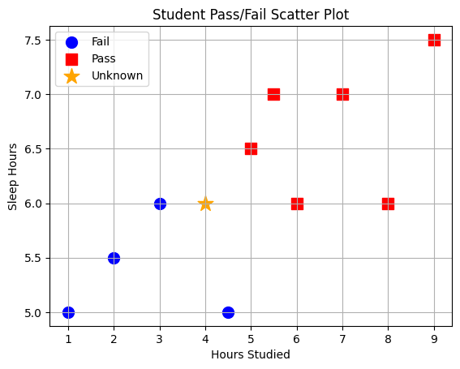
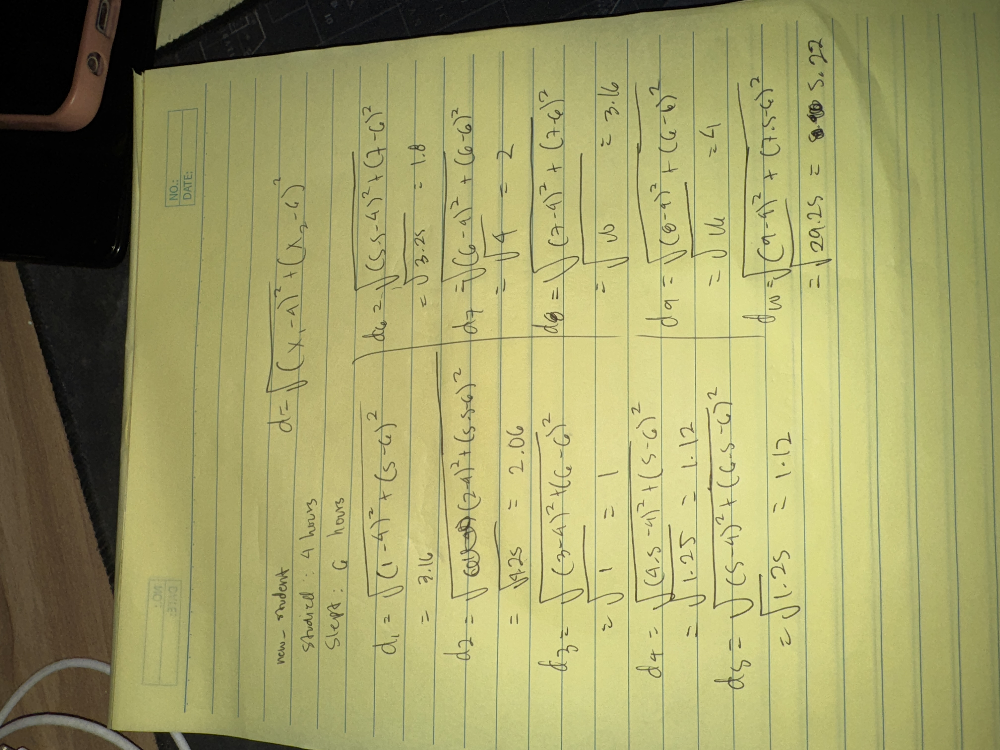

# Assignment 1 Solution

Using k-Nearest Neighbours, predict if a student will **Pass (1)** or **Fail (0)** based on:

- $X_1$ = Hours Studied
- $X_2$ = Sleep Hours

---

## Training Data (10 Students)

| Student | Hours Studied $X_1$ | Sleep Hours $X_2$ | Pass/Fail (Y) |
| ------- | ------------------- | ----------------- | ------------- |
| 1       | 1.0                 | 5.0               | 0 (Fail)      |
| 2       | 2.0                 | 5.5               | 0 (Fail)      |
| 3       | 3.0                 | 6.0               | 0 (Fail)      |
| 4       | 4.5                 | 5.0               | 0 (Fail)      |
| 5       | 5.0                 | 6.5               | 1 (Pass)      |
| 6       | 5.5                 | 7.0               | 1 (Pass)      |
| 7       | 6.0                 | 6.0               | 1 (Pass)      |
| 8       | 7.0                 | 7.0               | 1 (Pass)      |
| 9       | 8.0                 | 6.0               | 1 (Pass)      |
| 10      | 9.0                 | 7.5               | 1 (Pass)      |

---

## Task

A new student studied **4 hours** and slept **6 hours**.  
We want to predict whether they **Pass** or **Fail** using **KNN with k = 3**.

---

## 1. Plot all data points using a scatter plot (10 points)

- Use a circle 🔵 for students who failed.
- Use a square 🟥 for students who passed.
- Use a star ⭐ for the unknown data point.

**Plot:**

---

## 2. Compute Distances (10 points)

**Note:** Please show all solutions

**Solving Solution:**

For the new student, compute the **Euclidean distance** from all data points:

$$
d = \sqrt{(X_1 - 4)^2 + (X_2 - 6)^2}
$$

Fill in the table below:

| Student | Hours Studied (X1) | Sleep Hours (X2) | Pass/Fail (Y) | Euclidean Distance |
| ------- | ------------------ | ---------------- | ------------- | ------------------ |
| 1       | 1.0                | 5.0              | 0             | 3.16               |
| 2       | 2.0                | 5.5              | 0             | 2.06               |
| 3       | 3.0                | 6.0              | 0             | 1                  |
| 4       | 4.5                | 5.0              | 0             | 1.12               |
| 5       | 5.0                | 6.5              | 1             | 1.12               |
| 6       | 5.5                | 7.0              | 1             | 1.8                |
| 7       | 6.0                | 6.0              | 1             | 2                  |
| 8       | 7.0                | 7.0              | 1             | 3.16               |
| 9       | 8.0                | 6.0              | 1             | 4                  |
| 10      | 9.0                | 7.5              | 1             | 5.22               |

---

## 2. Find the 3 Nearest Neighbors (3 points)

- Highlight the rows with the **3 smallest distances**.

| Student | Hours Studied (X1) | Sleep Hours (X2) | Pass/Fail (Y) | Euclidean Distance |
| ------- | ------------------ | ---------------- | ------------- | ------------------ |
| 1       | 1.0                | 5.0              | 0             | 3.16               |
| 2       | 2.0                | 5.5              | 0             | 2.06               |
| ***3*** | ***3.0***          | ***6.0***        | ***0***       | ***1.00***         |
| ***4*** | ***4.5***          | ***5.0***        | ***0***       | ***1.12***         |
| ***5*** | ***5.0***          | ***6.5***        | ***1***       | ***1.12***         |
| 6       | 5.5                | 7.0              | 1             | 1.80               |
| 7       | 6.0                | 6.0              | 1             | 2.00               |
| 8       | 7.0                | 7.0              | 1             | 3.16               |
| 9       | 8.0                | 6.0              | 1             | 4.00               |
| 10      | 9.0                | 7.5              | 1             | 5.22               |

---

## 3. Majority Vote (2 points)

- Count how many are **Pass (1)** and how many are **Fail (0)**.
- Predict the outcome for the new student.

| Student | Hours Studied (X1) | Sleep Hours (X2) | Pass/Fail (Y) | Euclidean Distance |
| ------- | ------------------ | ---------------- | ------------- | ------------------ |
| 1       | 1.0                | 5.0              | 0             | 3.16               |
| 2       | 2.0                | 5.5              | 0             | 2.06               |
| ***3*** | ***3.0***          | ***6.0***        | ***0***       | ***1.00***         |
| ***4*** | ***4.5***          | ***5.0***        | ***0***       | ***1.12***         |
| ***5*** | ***5.0***          | ***6.5***        | ***1***       | ***1.12***         |
| 6       | 5.5                | 7.0              | 1             | 1.80               |
| 7       | 6.0                | 6.0              | 1             | 2.00               |
| 8       | 7.0                | 7.0              | 1             | 3.16               |
| 9       | 8.0                | 6.0              | 1             | 4.00               |
| 10      | 9.0                | 7.5              | 1             | 5.22               |

**Prediction:** A new student who studied 4 hours and slept 6 hours will **fail** the exam.

---

## 4. Discussion Questions (5 points)

1. What was your final prediction?
**The new student who studied for 4 hours and slept for 6 hours will fail the exam**

2. How would the prediction change if we used **k = 5** instead of **k = 3**?
**If k = 5, the majority would be Pass (1). So the new student would pass the exam if k = 5**
---
