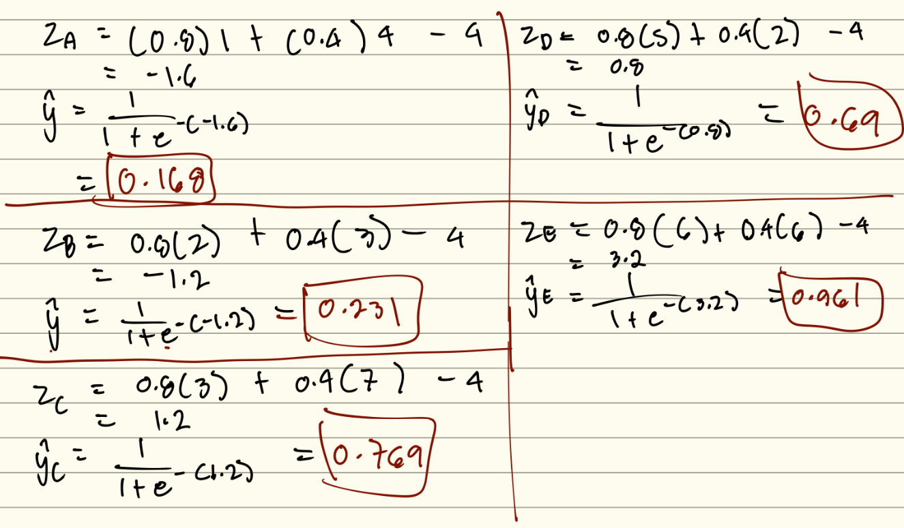
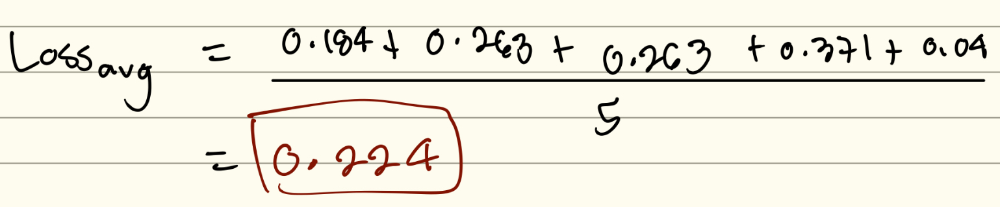
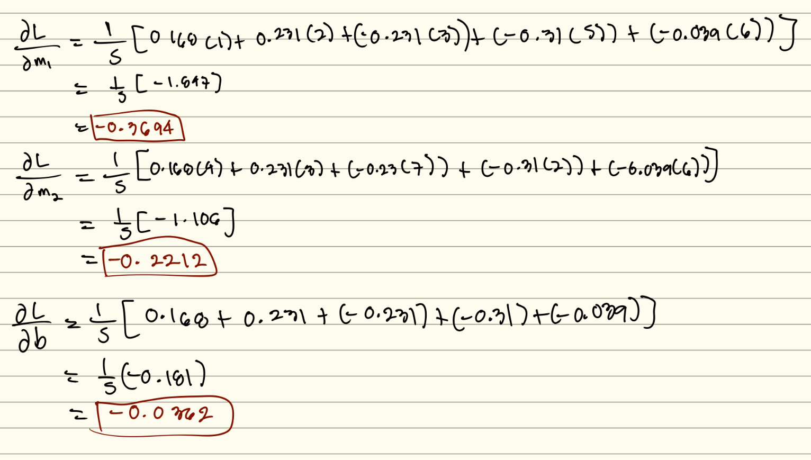
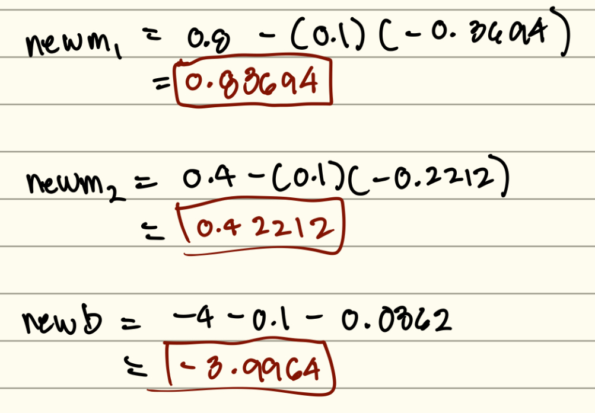
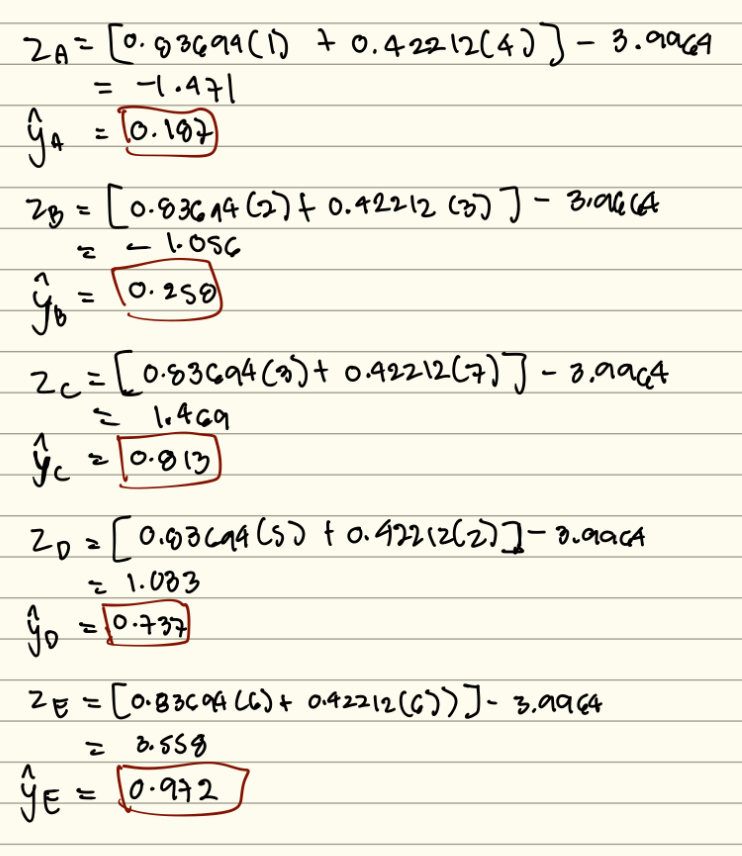
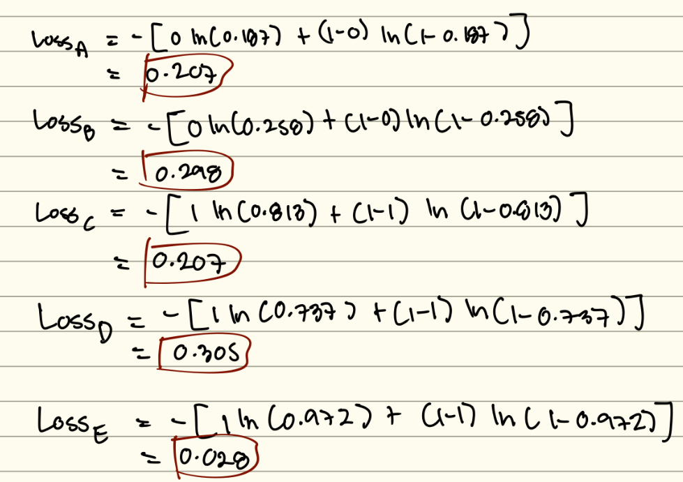
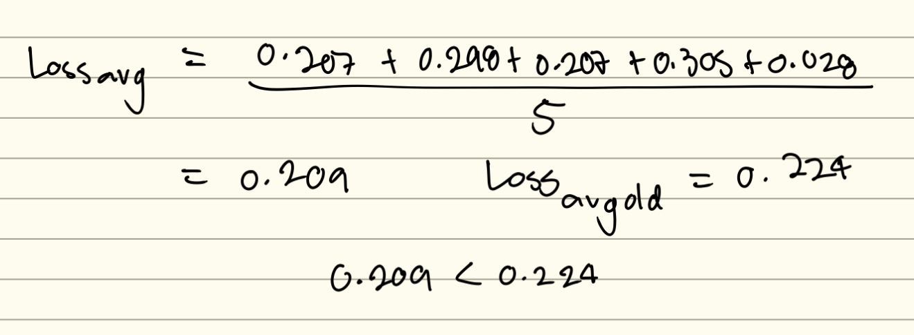

# Assignment 3: 

## Predicting Customer Purchase using Logistic Regression 
An online store wants to predict whether a visitor will **purchase a product $(y = 1)$** or **leave without buying $(y = 0)$**.  

We collect two features about each customer:

- $x_1$ = Time spent browsing the website (minutes)
- $x_2$ = Number of product pages viewed
- $y$ = Purchase outcome (1 = purchase, 0 = no purchase)

We need to use **logistic regression** to model the probability of purchase:

$$
\hat{y} = \sigma(w_1 x_1 + w_2 x_2 + b)
$$

where 

$$
\sigma(z) = \frac{1}{1+e^{-z}}
$$

---

## Dataset

| Customer | Time on site (x₁) | Pages viewed (x₂) | Purchase (y) |
|----------|-------------------:|------------------:|-------------:|
| A        | 1                  | 4                 | 0            |
| B        | 2                  | 3                 | 0            |
| C        | 3                  | 7                 | 1            |
| D        | 5                  | 2                 | 1            |
| E        | 6                  | 6                 | 1            |

Initial model parameters:
- $m_1 = 0.8$
- $m_2 = 0.4$  
- $b = -4.0$

---

## Tasks

### 1. Compute Probabilities (5 points)
For each customer A to E:

- Compute the linear score:  

$$
z = w_1 x_1 + w_2 x_2 + b
$$

- Compute the predicted probability:  

$$
\hat{y} = \sigma(z)
$$

| Customer | Time on site (x₁) | Pages viewed (x₂) | Purchase (y) | $\hat{y}$ 
|----------|-------------------:|------------------:|-------------:|-------------:|
| A        | 1                  | 4                 | 0            | 0.168            |
| B        | 2                  | 3                 | 0            | 0.231            |
| C        | 3                  | 7                 | 1            | 0.769            |
| D        | 5                  | 2                 | 1            | 0.69            |
| E        | 6                  | 6                 | 1            | 0.961            |

### 2. Compute Average Loss (6 points)

Compute the Binary Cross-Entropy (BCE) loss for each sample:

$$
Loss = -\big[ y \ln(\hat{y}) + (1-y)\ln(1-\hat{y}) \big]
$$

- Fill in the table by reporting the **loss per customer**  
 
| Customer | Time on site (x₁) | Pages viewed (x₂) | Purchase (y) | $\hat{y}$ | $Loss$ |
|----------|-------------------:|------------------:|-------------:|-------------:|-------------:|
| A        | 1                  | 4                 | 0            | 0.168            | 0.194            |
| B        | 2                  | 3                 | 0            | 0.231            | 0.263            |
| C        | 3                  | 7                 | 1            | 0.769            | 0.263            |
| D        | 5                  | 2                 | 1            | 0.69            | 0.371            |
| E        | 6                  | 6                 | 1            | 0.961           | 0.04            |

  - Report the **average BCE loss** over all 5 customers  

$$
Loss_{avg} = \frac{1}{N} \sum_{i=1}^N Loss_i 
$$

$$
Loss_{avg} = 0.224
$$

### 3. Update the slope and intercept using Gradient Descent (6 points)
   Perform **one step of gradient descent** with learning rate $\eta = 0.1$:  
   - Compute gradients of the loss w.r.t. $m_1, m_2, b$ 

$$
\frac{\partial L}{\partial m_1} = -0.3694 \quad
\frac{\partial L}{\partial m_2} = -0.2212, \quad
\frac{\partial L}{\partial b} = -0.0362
$$

 
 

   - Calculate the new slopes $m_1, m_2$  and intercept $b$ :
     
$$
new m_1 = m_1 - \eta \frac{\partial L}{\partial m_1}, \quad 
new m_2 = m_2 - \eta \frac{\partial L}{\partial m_2}, \quad
new b = b - \eta \frac{\partial L}{\partial b}
$$

$$
new m_1 = 0.83694, \quad
new m_2 = 0.42212, \quad
new b = -3.9964
$$

### 4. Compute new probabilities using the new slopes and intercept (5 points)

| Customer | Time on site (x₁) | Pages viewed (x₂) | Purchase (y) | new $\hat{y}$ 
|----------|-------------------:|------------------:|-------------:|-------------:|
| A        | 1                  | 4                 | 0            | 0.187            |
| B        | 2                  | 3                 | 0            | 0.258            |
| C        | 3                  | 7                 | 1            | 0.813            |
| D        | 5                  | 2                 | 1            | 0.737            |
| E        | 6                  | 6                 | 1            | 0.972            |

### 5. Compute new Average Loss (6 points)
- Fill in the table by computing the **new loss per customer**  
 

| Customer | Time on site (x₁) | Pages viewed (x₂) | Purchase (y) | $\hat{y}$ | new $Loss$ |
|----------|-------------------:|------------------:|-------------:|-------------:|-------------:|
| A        | 1                  | 4                 | 0            | 0.187            | 0.207            |
| B        | 2                  | 3                 | 0            | 0.258            | 0.298            |
| C        | 3                  | 7                 | 1            | 0.813            | 0.207            |
| D        | 5                  | 2                 | 1            | 0.737            | 0.305            |
| E        | 6                  | 6                 | 1            | 0.972            | 0.028            |

- Report the **new average BCE loss** over all 5 customers. (Note: The new average loss must be lower than the previous average loss)

$$
New Loss_{avg} = 0.205
$$

